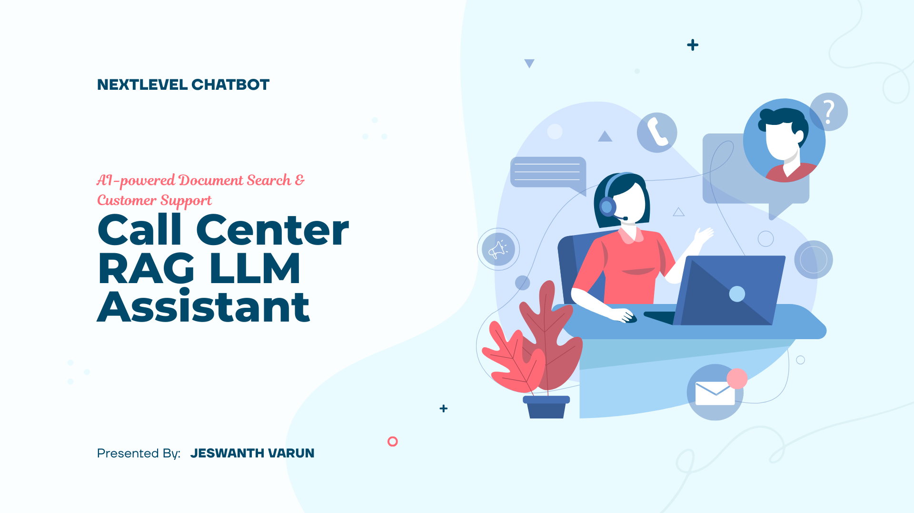
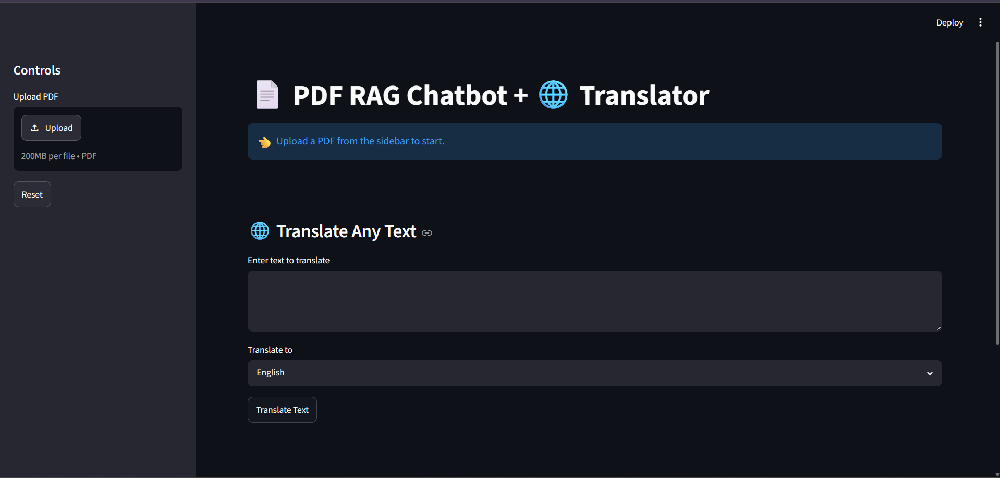
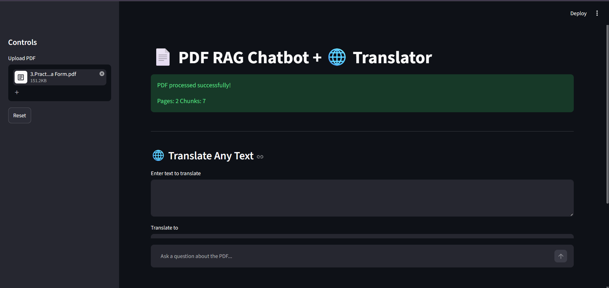
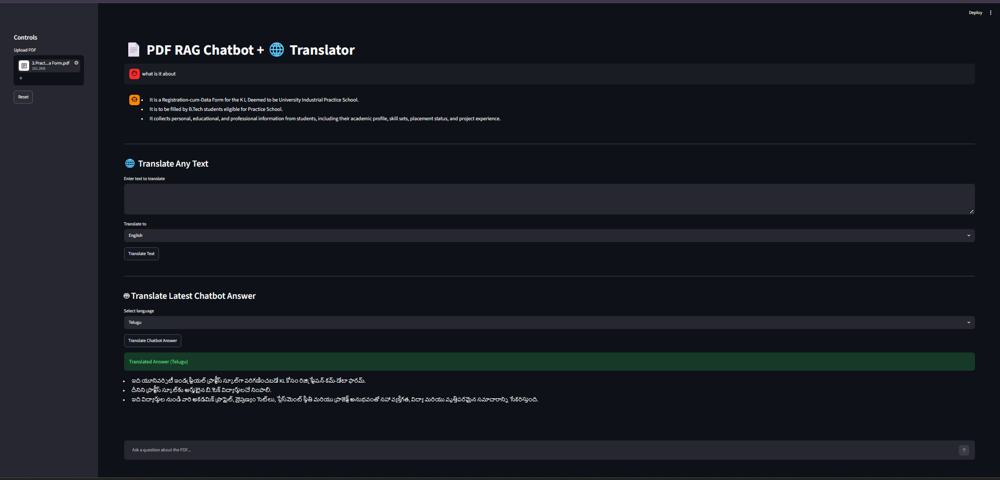

<p align="center">
  
</p>

# 📞 Call Center RAG LLM Assistant
# 📞 Call Center RAG LLM Assistant


An AI-powered Call Center Assistant that uses Retrieval-Augmented Generation (RAG) and Large Language Models (LLMs) to answer customer queries from uploaded documents.

---

## 🚀 Features

- 📄 Upload PDF documents
- 🤖 AI-powered question answering
- 🔍 Semantic document search
- 💬 Natural language responses
- 🌐 Flask Web Interface
- 📚 RAG Pipeline
- ⚡ Fast document retrieval

---

## 🛠 Technologies Used

- Python
- Flask
- Transformers
- Hugging Face
- FAISS
- LangChain
- HTML
- CSS

---

## 📂 Project Structure

```
call-center-rag-llm-assistant/
│
├── app.py
├── README.md
├── LICENSE
├── requirements.txt
├── templates/
│   └── index.html
└── docs/
```

---

## ⚙ Installation

Clone the repository

```bash
git clone https://github.com/ChVarun31256/call-center-rag-llm-assistant.git
```

Go to project folder

```bash
cd call-center-rag-llm-assistant
```

Install dependencies

```bash
pip install -r requirements.txt
```

Run the project

```bash
python app.py
```

---

## 📸 Screenshots

### 🏠 Home Page



---

### 📄 Upload PDF



---

### 🤖 Chatbot Response



## 📈 Future Improvements

- Voice-based customer support
- Multi-language support
- Database integration
- Authentication
- Streamlit Dashboard

---

## 👨‍💻 Author

**Jeswanth Varun**

GitHub:
https://github.com/ChVarun31256

---

## 📄 License

This project is licensed under the MIT License.
